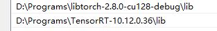

# MoerEngine

实时渲染引擎

**| 简体中文 | [English](README.en.md) |**

## 依赖

* 操作系统
  * Windows 10 or 11
* 编译器（二选一）
  * MSVC == 19.44.*
  * clang（待测试）

* 其他
  * CMake >= 3.26.0 且 < 4.0.0 ([download link](https://github.com/Kitware/CMake/releases/tag/v3.31.9))
  * Git ([download link](https://git-scm.com/downloads))


## 如何构建&运行？

### MoerEngine

- 方法一：命令行

  ```bash
  # Clone仓库
  # 如果没有配置SSH的话，请把 `git@xxx` 替换为 `https://github.com/NJUCG/MoerEngine.git`
  git clone --branch dev-rhi-remake git@github.com:NJUCG/MoerEngine.git
  cd MoerEngine
  
  # 忽略一些特定commit对commit历史的影响
  git config --local blame.ignoreRevsFile .git-blame-ignore-revs
  
  # 下载Sponza场景文件，到此目录：`./asset/scenes/`
  git clone --branch sponza-scene-files --depth 1 git@github.com:NJUCG/MoerEngine.git ./asset/scenes/sponza
  
  # 根据模板创建一份MoerEngine的配置文件
  # 配置文件中，可以设置默认的渲染器（光栅化、光追）、默认分辨率等选项
  cp source/configs/template.MoerEngine.toml source/configs/MoerEngine.toml
  
  # 构建
  cmake -B build
  cmake --build build -j16 # change 16 to your cpu core count
  
  # 运行
  ./target/bin/Debug/MoerEditor.exe
  ```

  - 如果安装了 [just](https://github.com/casey/just)，你可以通过如下这两条命令部署、构建、启动引擎
    ```bash
    just setup
    just gbr # generate build run
    ```

- 方法二：Rider
  - TODO

### CUDA等AI组件支持

* 如果你希望在MoerEngine中启用CUDA、LibTorch、TensorRT，那么你需要手动在系统中安装这三个依赖，再在MoerEngine中配置他们。接下来为启用AI组件的具体操作手册：
1. 下载依赖
   * [CUDA Toolkit 12.8 Downloads](https://developer.nvidia.com/cuda-12-8-0-download-archive)
   * [PyTorch Downloads](https://pytorch.org/get-started/locally/)
   * [TensorRT 10.x Downloads](https://developer.nvidia.com/tensorrt/download/10x)
   * 推荐版本
     * CUDA Toolkit 12.8
     * libtorch-2.8.0-cu128
     * TensorRT-10.12.0.36
     * **请注意，LibTorch和TensorRT版本需要与CUDAToolkit版本相对应**

2. 根据模板创建配置文件（启用AI组件）
   * 根据 `template.EnableCuda.cmake` 创建 `EnableCuda.cmake`
   * 修改 `EnableCuda.cmake` 的内容
   * 注：MoerEngine的构建系统会自动检测 `EnableCuda.cmake` 文件。**如果该文件存在，则会启用AI组件**

3. 将动态库添加进PATH

   * 将你安装的LibTorch和TensorRT的 `lib` 目录添加进 `PATH` 环境变量。例子如下图：
   * 
   * 注：如果动态库缺失，则引擎会在没有任何错误提示的情况下崩溃

4. 重新编译MoerEngine

   ```bash
   cmake -B build
   cmake --build build -j16
   # 或者使用just
   just gb # generate build
   ```

   * 观察日志，若generate的日志出现了 `WITH_CUDA=1`，则成功启用AI相关组件；若日志中为 `WITH_CUDA=0`，则没有启用AI相关组件

5. 配置VSCode的IntelliSense**（可选）**
   * 设置环境变量 `CUDA_PATH`、`LIBTORCH_PATH`、`TENSORRT_PATH`。例子如下图：
   * 
   * 

## 使用方法

### 如何渲染其他场景？

- 方法一：GUI
  - 打开MoerEditor后，点击 `OpenScene` 打开文件选择器，并根据右下角支持格式来选择不同格式的场景

- 方法二：配置文件
  - 在 `MoerEditor.exe` 同目录下的 `config/MoerEngine.toml` 中，修改启动时默认场景路径
  - 注：在每次编译MoerEngine时，`./target/bin/Debug/config/*` 会被替换为 `./source/configs/*`。所以如果你是开发者，请修改 `./source/configs/MoerEngine.toml`


### 为什么我第一次打开MoerEngine，看不到任何画面？

* 需要手动拖拽Config等窗口，设置布局
  * 这是一个bug，参见 [issus#82](https://github.com/NJUCG/MoerEngine/issues/82)

### 如何移动摄像机

- MoerEngine的摄像机控制逻辑与UnrealEngine类似
  - 长按右键时，通过 `W/A/S/D/Q/E` 来移动摄像机
  - 长按右键时，拖动鼠标 来 旋转摄像机
  - 长按左键时，拖动鼠标 来 在水平面内操作摄像机
  - 长按中键时，拖动鼠标 来 在竖直面内操作摄像机
- 按下 `F` 键，进入漫游模式
- 通过GUI来设置摄像机移动速度和FOV

### VSCode配置相关

- 设置中的 `C_Cpp.default.compilerPath` 字段不能使用msvc编译器，否则IntelliSense会出现假错。推荐使用clang
  - 注：和编译无关，只和 IntelliSense（IDE的智能代码高亮与补全）有关

