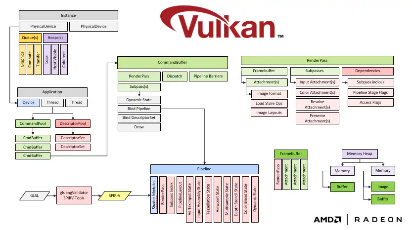
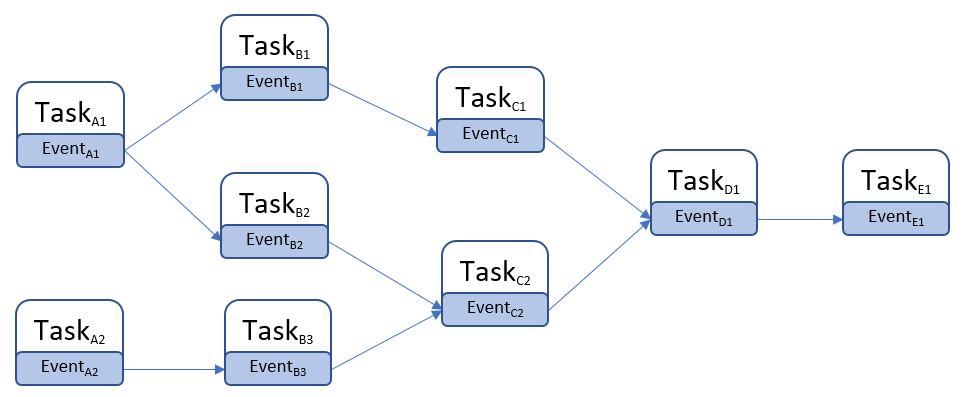

# MoerEngine DOC

### Tree Structure

```
  .
  ├─LICENSE
  ├─source
  |   ├─test
  |   ├─runtime
  |   |    ├─modules
  |   |    |    ├─render
  |   |    |    |   ├─platform
  |   |    |    |   ├─rhi
  |   |    |    |   ├─shader
  |   |    ├─core
  |   |    |  ├─platform
  |   |    |  ├─misc
  |   |    |  ├─log
  |   |    |  ├─config
  |   ├─editor
  |   ├─configs
  ├─doc
  ├─cmake
  ├─asset
       
```

### Render Module

- seperate thread from main thread
- implement RHI to support Vulkan and DX12
  - low level rhi, like Vulkan and DX12
   
- use cross compiler(currently DXC) to compile HLSL for DX12 and Vulkan

#### RHI

##### Vulkan overview


##### RHI Example(experimental)

```cpp

class TestShader : public Shader {
    DEFINE_SHADER_TYPE(TestShader, Global, RHI_API)
public:
    BEGIN_SHADER_PARAMETER_DEFINITION(Parameters)

    DEFINE_SHADER_PARAM_UAV(RWTexture2D, write_target)
    DEFINE_SHADER_PARAM_ATTACHMENT_BINDING()
    END_SHADER_PARAMETER_DEFINITION(Parameters)
};
//use macro to register global shader
IMPLEMENT_SHADER_TYPE(TestShader, "testFile.vert", "main", EShaderType::ST_VERTEX)

void Example(){
    const uint16_t      indices[] = {1, 2, 3};
    RHIBufferCreateInfo buffer_info;
    buffer_info.SetUsage(EBufferUsageFlags::INDEX_BUFFER)
        .SetStride(sizeof(uint16_t))
        .SetSize(sizeof(indices));

    RHIBufferRef indexBuffer = CreateBufferFromData(buffer_info, sizeof(indices), (void*)indices);

    RHIBufferCreateInfo v_info;
    v_info.SetSize(16).SetStride(4).SetUsage(EBufferUsageFlags::VERTEX_BUFFER);

    const float  vertex_data[] = {-1, -1, 0, 1, -1, 0, -1, 1, 0, 1, 1, 1};
    RHIBufferRef vertex_buffer = CreateBufferFromData(v_info, sizeof(vertex_data), (void*)vertex_data);

    

    RHIGraphicsPipelineStateInitializer init;
    init.num_samples                 = 1;
    init.multi_view_count            = 1;
    init.stencil_attachment_store_op = EAttachmentStoreOp::NONE;
    init.stencil_attachment_load_op  = EAttachmentLoadOp::NONE;
    init.depth_attachment_store_op   = EAttachmentStoreOp::NONE;
    init.depth_attachment_load_op    = EAttachmentLoadOp::NONE;
    init.color_attachment_count      = 1;
    init.color_attachment_formats[0] = EPixelFormat::PF_R8G8B8A8_SRGB;
    init.color_attachment_flags[0]   = ETextureUsageFlags::COLOR_ATTACHMENT;
    init.primitive_topology          = EPrimitiveTopology::TRIANGLE_LIST;

    RHIShaderBoundStateInput& shader_state = init.shader_stage;
    shader_state.p_vertex_input_state = g_rhi->RHICreateVertexInputState(vertex_init_list);
    // and fragment shader
    ShaderRef<TestShader> test_shader = ShaderResourceManager::GetShader<TestShader>();
    RHIVertexShader vert = test_shader->GetRHIVertexShader();

    shader_state.vertex_shader = vert;

    VertexInputStateInitializerList vertex_init_list;
    for (int i = 0; i < 1; ++i) {
        vertex_init_list[i].type            = EVertexElementType::VET_Float3;
        vertex_init_list[i].offset          = 0;
        vertex_init_list[i].stride          = sizeof(Moer::Vector3f);
        vertex_init_list[i].input_rate      = EVertexInputRate::VIR_VERTEX;
        vertex_init_list[i].attribute_index = 0;
        vertex_init_list[i].binding_index   = 0;
    }

    const Moer::Vector2i attachment_size(4, 4);
    RHITextureCreateInfo tex_info;
    tex_info.SetDimension(ETextureDimension::TEX_2D)
        .SetFormat(PF_R8G8B8A8_SRGB)
        .SetInitialLayout(ETextureLayout::TEXTURE_LAYOUT_COLOR_ATTACHMENT)
        .SetExtent(attachment_size)
        .SetClearAttachment(RHIClearAttachment())
        .SetDepth(1)
        .SetArraySize(1)
        .SetNumMips(1)
        .SetNumSamples(1)
        .SetUsageFlags(ETextureUsageFlags::COLOR_ATTACHMENT);

    //out_put texture
    RHITextureRef tex = g_rhi->RHICreateTexture(tex_info);

    RHIGraphicsPipelineStateRef pso = g_rhi->RHICreateGraphicsPipelineState(init);


    RHIUnorderedAccessViewRef test_view =
        g_rhi->RHICreateUnorderedAccessView(tex,
                                            RHIViewInfo::CreateTextureUAVInfo()
                                                .SetFormat((PF_R8G8B8A8_SRGB)));
    
    //parameter binding
    TestShader::Parameters* params = ShaderParamAllocator<TestShader>::Alloc();
    params->write_target = test_view;


    RHIGraphicsCommandList* command_list = g_rhi->CreateGraphicsCommandList(pso);
    
    //need low level manner to control bindings
    command_list->BindParams(params);

    RHIRenderPassInfo pass_info;
    pass_info.GeneratePipelineAttachmentInfo();
    command_list->BeginRenderPass(pass_info, "triangle pass");
    command_list->BindVertexBuffers(0, 1, vertex_buffer);

    command_list->DrawIndexedInstanced(1, 1, 0, 0);

    command_list->EndRenderPass();

    RHICommandQueue*                         graphics_queue = g_rhi->CreateCommandQueue(ECommandQueueType::GRAPHICS);
    const std::array<RHICommandListBase*, 1> _command_array{command_list};
    graphics_queue->SubmitCommands(1, _command_array.data());
    
}
```


### Core

#### TaskGraph
For CPU parallelism. Ported from UE4(simpler job schedular than UE5), supporting fewer threads(up to 23 worker threads for now).



##### Example
```cpp
LOG_INFO("=============== task is not executed until its prerequisite is completed success ================");
    {// a task is not executed until all its prerequisites are completed
        bool            bExecuted = false;
        GraphEventArray Prereqs{GraphEvent::CreateGraphEvent(), GraphEvent::CreateGraphEvent()};
        GraphEventRef   MainTask = FunctionGraphTask::ConstructAndDispatchWhenReady([&bExecuted] { bExecuted = true; }, &Prereqs);
        // dummy task that is executed while the main task is waiting for its prereqs
        FunctionGraphTask::ConstructAndDispatchWhenReady([] {})->Wait();
        assert(!bExecuted);

        Prereqs[0]->TryUnlockSubsequents();
        FunctionGraphTask::ConstructAndDispatchWhenReady([] {})->Wait();
        assert(!bExecuted);

        Prereqs[1]->TryUnlockSubsequents();
        MainTask->Wait();
        assert(bExecuted);
    }

```