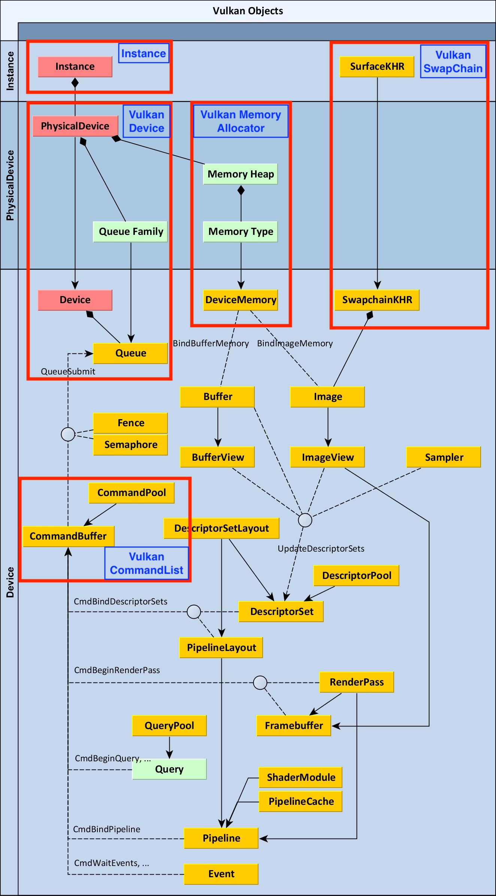
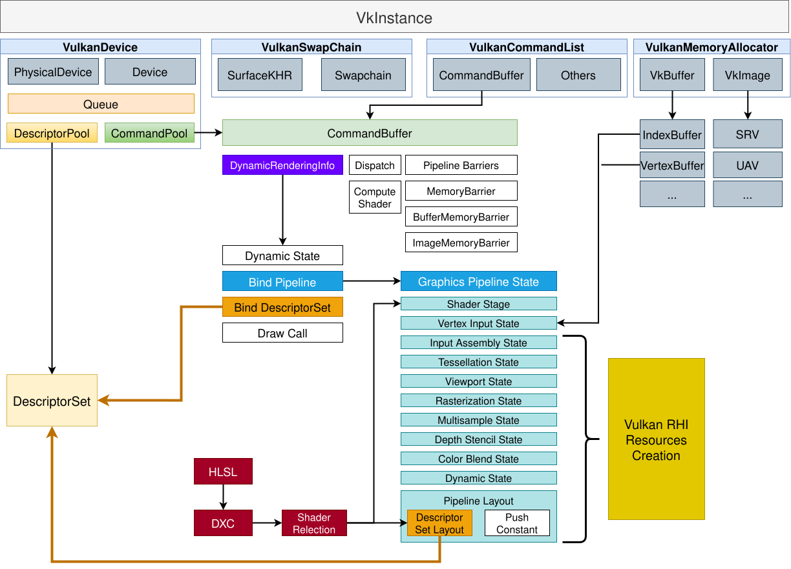

# Vulkan RHI
[Vulkan Objects](#vulkan-objects)

[Vulkan Resources](#vulkan-resources)

## Vulkan Objects


1. Instance：使用原生的`VkInstance`, 作为Vulkan实例的句柄；
2. VulkanDevice：封装Vulkan的物理设备`VkPhysicalDevice`和逻辑设备`VkDevice`，提供接口访问设备的队列、属性等;
    
    ```C++
    VkPhysicalDevice                 m_gpu;
    VkPhysicalDeviceProperties       m_gpu_props;
    VulkanPhysicalDeviceFeatures     m_gpu_features;
    VkPhysicalDeviceMemoryProperties m_gpu_mem_props;
    TExtensionArray                  m_gpu_extensions;
    QueueFamilyIndices               m_queue_family_indices;

    VkDevice m_device;
    VkQueue  m_graphics_queue;
    VkQueue  m_present_queue;
    VkQueue  m_compute_queue;
    VkQueue  m_transfer_queue;

    VkCommandPool m_default_pool;
    VkCommandPool m_transfer_pool;
    ```

3. VulkanSwapChain：封装Vulkan的交换链`VkSwapchain`和绘制表面`VkSurfaceKHR`，作为渲染和显示的中介；

    ```C++
    VkInstance     m_instance;
    VulkanDevice*  m_device;
    VkSwapchainKHR m_swap_chain;
    VkSurfaceKHR   m_surface;

    std::vector<VkSemaphore> m_image_acquired_semaphores;
    std::vector<VkSemaphore> m_render_complete_semaphores;

    std::vector<VkImage>         m_swap_chain_images;
    std::vector<SwapChainBuffer> m_swap_chain_buffers;

    uint32_t current_image_index;
    uint32_t semaphore_index;

    VkSurfaceFormatKHR surface_format;
    ```

4. VulkanMemoryAllocator：AMD提供的Vulkan内存分配器[VulkanMemoryAllocator](https://gpuopen.com/vulkan-memory-allocator/)，管理`VkBuffer`, `VkImage`的内存分配，处理资源的Suballocation；
    - `VkBuffer`
        ```C++
        struct BufferAlloc {
            VkBuffer      buffer;
            VmaAllocation alloc;
        } m_alloc;
        ```
    - `VkImage`
        ```C++
        struct TextureAlloc {
            VkImage       image;
            VmaAllocation alloc;
        } m_alloc;
        ```

5. VulkanCommandList：Vulkan的命令列表，封装`VkCommandBuffer`，用于记录绘制命令；

Vulkan封装后的RHI架构图暂时如下：

   
## Vulkan Resources

- VulkanRHISampler
- VulkanRHIRasterizationState
- VulkanRHIDepthStencilState
- VulkanRHIMultisampleState
- VulkanRHIBlendState
- VulkanRHIVertexInputState
- VulkanRHIVertexShader
- VulkanRHIFragmentShader
- VulkanRHIGeometryShader
- VulkanRHIMeshShader
- VulkanRHIAmplificationShader
- VulkanRHIComputeShader
- VulkanRHIShaderLibrary
- VulkanRHIFence
- VulkanRHIShaderBoundState
- VulkanRHIGraphicsPipelineState
- VulkanRHIComputePipelineState
- VulkanRHITexture
- VulkanRHIShaderResourceView
- VulkanRHIUnorderedAccessView
- VulkanRHIShader