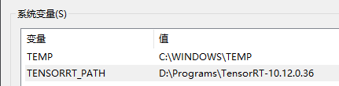
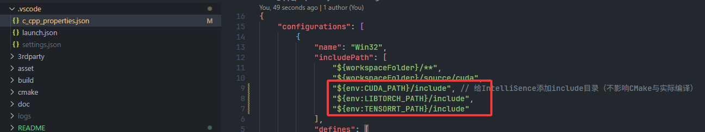
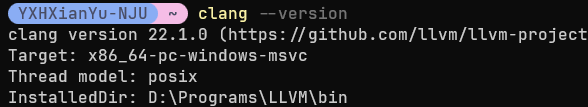
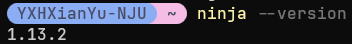
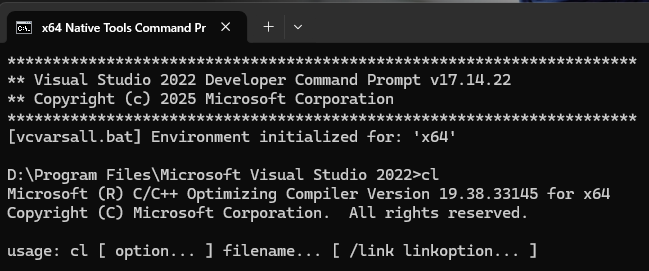

# 构建手册

## 目录

- [1. 依赖](#1-依赖)
- [2. MoerEngine](#2-moerengine)
- [3. CUDA等AI组件支持](#3-cuda等ai组件支持)
  - [3.1 注意事项](#31-注意事项)
- [4. NRD降噪器支持](#4-nrd降噪器支持)
- [5. 其他](#5-其他)
  - [5.1 安装依赖具体步骤](#51-安装依赖具体步骤)

## 1. 依赖

* 操作系统：Windows 10 or 11
* 编译器：Clang ([download link](https://github.com/llvm/llvm-project/releases)) + ninja ([download link](https://github.com/ninja-build/ninja))
  * 备选：MSVC
* Vulkan SDK 1.3 ([download link](https://vulkan.lunarg.com/sdk/home))
* CMake >= 3.26.0 且 < 4.0.0 ([download link](https://github.com/Kitware/CMake/releases/tag/v3.31.9))
* Git ([download link](https://git-scm.com/downloads))
* 注：MSVC、Clang、Ninja的具体编译方法见文档末尾

## 2. MoerEngine

- 方法一：命令行

  ```bash
  # Clone仓库
  # 如果没有配置SSH的话，请把 `git@xxx` 替换为 `https://github.com/NJUCG/MoerEngine.git`
  # MoerEngine新的依赖项均使用submodule形式引入，所以请添加--recursive来clone所有依赖项
  # 如果在clone时忘记添加submodule相关参数，请执行git submodule update --init --depth 1
  git clone --recurse-submodules --shallow-submodules git@github.com:NJUCG/MoerEngine.git
  cd MoerEngine
  
  # 忽略一些特定commit对commit历史的影响（只影响开发过程，不影响编译和使用）
  git config --local blame.ignoreRevsFile .git-blame-ignore-revs
  
  # 根据模板创建一份MoerEngine的配置文件
  # 配置文件中，可以设置默认的渲染器（光栅化、光追）、默认分辨率等选项
  cp template.MoerEngine.toml MoerEngine.toml
  
  # 构建
  # Clang + ninja
  cmake -B build -G Ninja -DCMAKE_C_COMPILER=clang -DCMAKE_CXX_COMPILER=clang++
  # # MSVC
  # cmake -B build
  cmake --build build -j16 # change 16 to your cpu core count
  
  # 运行
  ./target/bin/Debug/MoerEditor.exe
  ```
  
  - 如果安装了 [just](https://github.com/casey/just)，你可以参考根目录下的 `template.justfile` 文件来编写你自己的脚本
  
- 方法二：Visual Studio 2022（GUI）

  Visual Studio 2022 可以直接打开根目录包含 `CMakeLists.txt` 的工程，不需要生成 `.sln`。参见 [Microsoft：Visual Studio 中的 CMake 项目](https://learn.microsoft.com/zh-cn/cpp/build/cmake-projects-in-visual-studio?view=msvc-170)。

  1. 在 Visual Studio Installer 中安装“使用 C++ 的桌面开发”，并勾选“用于 Windows 的 C++ CMake 工具”。
  2. 在文件管理器中把 `template.MoerEngine.toml` 复制为仓库根目录下的 `MoerEngine.toml`。首次 Configure 前必须存在该文件。
  3. 在 Visual Studio 中选择 `File -> Open -> Folder` 并打开仓库根目录。根目录已有 `CMakeLists.txt`，Visual Studio 会自动启用 CMake integration 并生成默认配置的 cache。
  4. 在顶部 Configuration 下拉框选择 `x64-Debug`。如果自动 Configure 没有运行，或修改配置后需要重新生成，选择 `Project -> Configure Cache`；错误信息可在 Output 窗口的 CMake 分类中查看。
  5. Configure 成功后，在 Startup Item 下拉框选择 `MoerEditor.exe`。选择 `Build -> Build All`，或在 Solution Explorer 的 CMake Targets View 中右键 `MoerEditor` 后选择 Build。
  6. 按 `F5` 构建并调试；若不附加调试器，按 `Ctrl+F5`，或选择 `Debug -> Start Without Debugging`。

  Debug 产物位于 `target/bin/Debug/MoerEditor.exe`。Release 构建时在 Configuration 下拉框切换到 `x64-Release`，产物位于 `target/bin/Release/MoerEditor.exe`。

  Rider 2026.1 开始提供 CMake C++ 工程的 Beta 支持，但当前版本尚未提供与 CLion 完全一致的 CMake toolchain/profile 配置界面，因此本文不把未经验证的 Rider 菜单路径作为受支持构建方法。参见 [JetBrains Rider 2026.1 CMake support](https://www.jetbrains.com/rider/whatsnew/2026-1/#cmake-support-for-c-gaming-projects-beta)。

- 成功启动后，可以参考 [DEVELOPMENT.md](DEVELOPMENT.md) 来了解MoerEngine的开发规范等其他内容

## 3. CUDA等AI组件支持

* 如果你希望在MoerEngine中启用CUDA、LibTorch、TensorRT，那么你需要手动在系统中安装这三个依赖，再在MoerEngine中配置他们。接下来为启用AI组件的具体操作手册：
1. 下载依赖
   * [CUDA Toolkit 12.8 Downloads](https://developer.nvidia.com/cuda-12-8-0-download-archive)
   * [PyTorch Downloads](https://pytorch.org/get-started/locally/)
   * [TensorRT 10.x Downloads](https://developer.nvidia.com/tensorrt/download/10x)
   * 推荐版本
     * CUDA Toolkit 12.8
     * libtorch-2.8.0-cu128
     * TensorRT-10.12.0.36
     * **请注意，LibTorch和TensorRT版本需要与CUDAToolkit版本相对应**

2. 根据模板创建配置文件（启用AI组件）
   * 根据 `template.EnableFeatures.cmake` 创建 `EnableFeatures.cmake`
   * 修改 `EnableFeatures.cmake` 中 CUDA 相关的配置项
   * 注：MoerEngine的构建系统会自动检测 `EnableFeatures.cmake` 文件。**如果该文件存在，则会启用对应的可选组件**

3. 将动态库添加进PATH

   * 将你安装的LibTorch和TensorRT的 `lib` 目录添加进 `PATH` 环境变量。例子如下图：
   * 
   * 注：如果动态库缺失，则引擎会在没有任何错误提示的情况下崩溃

4. 重新编译MoerEngine

   ```bash
   cmake -B build
   cmake --build build -j16
   # 或者使用just
   just gb # generate build
   ```

   * 观察日志，若generate的日志出现了 `WITH_CUDA=1`，则成功启用AI相关组件；若日志中为 `WITH_CUDA=0`，则没有启用AI相关组件

5. 配置VSCode的IntelliSense**（可选）**
   * 设置环境变量 `CUDA_PATH`、`LIBTORCH_PATH`、`TENSORRT_PATH`。例子如下图：
   * 
   * 

### 3.1 注意事项

* 启用CUDA后，光栅化渲染器就不支持Stencil模板测试了。原因是CUDA不支持 `PF_D32_SFLOAT_S8_UINT`

## 4. NRD降噪器支持

* MoerEngine支持NVIDIA NRD拓展。由于NVIDIA的封闭协议，MoerEngine无法直接引入NRD，需要用户自行下载NRD源码并进行配置。以下为具体操作步骤

1. Clone NRD源码
   ```bash
   # 推荐在非MoerEngine目录下Clone NRD源码，避免不小心提交NRD源码
   # 如果无法访问，请联系项目维护者
   git clone git@github.com:NJUCG/NRD.git
   ```

2. 根据模板创建配置文件
   * 根据 `template.EnableFeatures.cmake` 创建 `EnableFeatures.cmake`（如果已存在则跳过）
   * 修改 `EnableFeatures.cmake` 中 NRD 相关的配置项，将 `NRD_ROOT` 设置为你Clone的NRD源码路径

3. 重新编译MoerEngine

   ```bash
   cmake -B build
   cmake --build build -j16
   # 或者使用just
   just gb # generate build
   ```

   * 观察日志，若generate的日志出现了 `WITH_NRD=1`，则成功启用NRD；若日志中为 `WITH_NRD=0`，则没有启用NRD

## 5. 其他

### 5.1 安装依赖具体步骤

* 安装Clang
  * 进入 [LLVM-Project Github Releases](https://github.com/llvm/llvm-project/releases)
  * 选择 `LLVM-22.x.x-win64.exe`，下载并根据指引安装
  * 安装完毕后，添加 `LLVM/bin` 到 `PATH` 环境变量
  * 在终端中输入 `clang --version`，若出现类似下图内容，则安装成功
  * 
* 安装Ninja
  * 进入 [ninja Github Releases](https://github.com/ninja-build/ninja/releases)
  * 选择 `ninja-win.zip`，下载，并解压到对应目录
  * 解压后，添加该目录到 `PATH` 环境变量
  * 在终端输入 `ninja --version`，若出现类似下图内容，则安装成功
  * 
* 安装MSVC
  * 下载 [Visual Studio Installer](https://visualstudio.microsoft.com/zh-hans/downloads/)
  * 在 VS Installer 中，选择对应版本VS（推荐2022），**并勾选 使用C++的桌面开发**
    * 如果找不到 Visual Studio 2022，可以在 [此网页](https://visualstudio.microsoft.com/zh-hans/vs/older-downloads/) 中选择2022并进行下载
  * 安装完毕后，在开始菜单搜索 `x64 Native Tools Command Prompt for VS 2022` 并打开。在此终端中输入 `cl`，如出现类似下图内容，则安装成功
  * 
