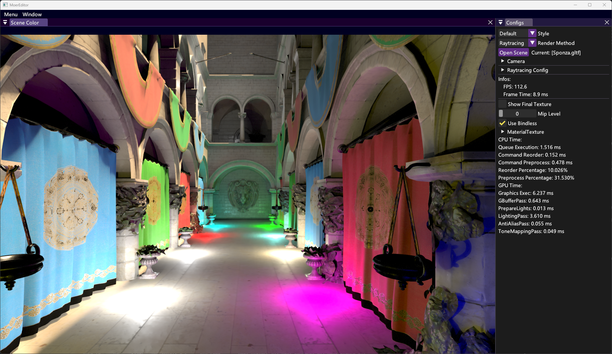
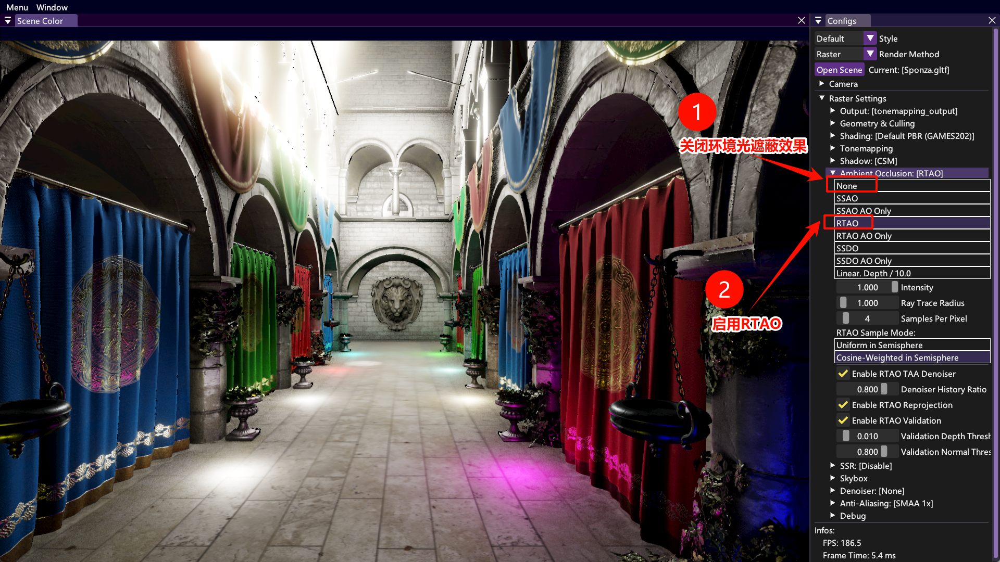
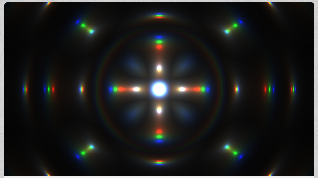
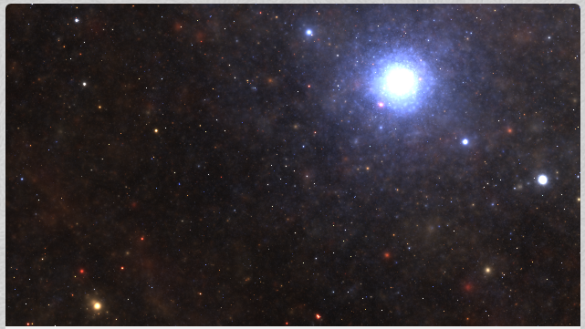

# 如何在MoerEngine中实现 景深 效果？

景深是一个经典的光学现象。

请阅读 [虚幻引擎 Cinematic Depth of Field文档](https://dev.epicgames.com/documentation/zh-cn/unreal-engine/cinematic-depth-of-field-in-unreal-engine)，这篇文章写的特别优秀，有非常多解释光路的示意图，可以加深对于景深的理解。

接下来，笔者将介绍 **在MoerEngine的光栅化渲染器中，实现景深效果** 的具体操作步骤。

## 0. Vibe Coding

推荐使用Claude Code或Cursor等AI工具辅助学习和开发。

MoerEngine有两套渲染管线，分别是 **光栅化管线** `renderer/raster` 和 **光线追踪管线** `renderer/raytracing`。我们的样例和教学都在  **光栅化管线** 下进行。因此，推荐让AI工具先熟悉一下 `renderer/raster` 模块下的内容，以便后续学习和开发。

*经笔者实验，现阶段的AI工具可以独立完成本教程几乎所有内容。所以笔者十分推荐直接对着AI进行学习。*

## 1. 背景

### 1.1 熟悉引擎

启动引擎后，你可以看到如下页面。其中，左侧是 *场景颜色*，右侧是 *配置页*。



> 启用NRD的光线追踪渲染器渲染效果

选择配置页的右上角 **Render Method**，可以切换引擎使用的渲染方法。目前共支持两种渲染方法：**Raytracing 光线追踪** 和 **Rasterization 光栅化**。请选择Render Method，并切换为 *Raster*。



> 光栅化渲染器渲染效果。右侧是配置面板

点击右侧的 `Raster Settings` - `Ambient Occlusion`，选择不同的环境光遮蔽算法，查看对应效果。如果MoerEngine光栅化在你的电脑上帧数比较低，可以将环境光遮蔽算法切换为 *SSAO*。

目前光栅化渲染器，默认启用 RTAO、自动曝光 等后处理算法。你可以修改这些算法的参数，查看对应的效果。（注：至2026.3.16，SSDO、SSR这两个算法损坏，尚未修复。因此，请勿启用这两个算法）

### 1.1 前置知识

实时渲染有比较多的前置知识需要了解。完整理解这些概念，往往需要数个月的学习。

因此，本文不会对基础概念做出解释，**请自行询问AI**（毕竟AI的解释比笔者的解释更优秀）。

### 1.2 IDE配置

* VSCode / Cursor：在插件商城安装 **clangd**

## 2. 单Pass景深

我们首先实现一个最基础的单Pass景深。

### 2.1 后处理Pass

渲染管线是由非常多Pass组成的，在 `RasterRenderer.cpp` 中，可以找到如下代码：

```c++
// Post Process Passes
// - Ambient Occlusion
auto              ao_result        = ao_pass->Process(raster_context, raster_config, camera, time);
TextureWithHandle processing_image = ao_result.ao_with_color;
uint              ao_only_idx      = ao_result.ao_only_idx;

rtao_denoiser_pass->ProcessInPlace(raster_context, raster_config, ao_only_idx);

// - Denoiser Pass (Bilateral Filter)
processing_image = bfd_pass->Process(raster_context, raster_config, processing_image);

// - Screen Space Reflection
processing_image = ssr_pass->Process(raster_context, raster_config, camera, processing_image);

// - Anti-aliasing
processing_image = aa_pass->Process(raster_context, raster_config, camera, processing_image);

// - Bloom Pass
processing_image = bloom_pass->Process(raster_context, raster_config, processing_image);

// - Tonemapping Pass
processing_image = tonemapping_pass->Process(raster_context, raster_config, processing_image);
```

上述所有Pass都是 **后处理Pass**。即，这个Pass的输入是全屏像素，输出也是全屏像素，这个Pass的Shader会对像素进行一些处理。例如，`ao_pass->Process(..)` 就是 *环境光遮蔽* 效果。

### 2.2 添加一个后处理Pass

熟悉一个项目最好的方式，就是直接上手改。以下是操作步骤：

1. 创建Pass源码

   * 在 `source\runtime\render\renderer\raster\` 目录下，创建 `DofPass.h`

   * 在 `DofPass.h` 内黏贴以下内容：

     ```c++
     #pragma once
     
     #include "scene/camera/Camera.h"
     #include "shader/ShaderPipeline.h"
     #include "shaderheaders/shared/raster/post_process/ShaderParameters.h"
     
     #include "RasterConfig.h"
     #include "RasterResource.h"
     #include "RasterTool.h"
     
     namespace Moer::Render::Raster {
     
     class DofPipeline : public RasterPipeline {
     public:
         DEFINE_RASTER_PIPELINE_CLASS(DofPipeline);
         DEFINE_SHADER_CONSTANT_STRUCT(DofPipelineBindlessParam, param);
         DEFINE_SHADER_BINDLESS_ARRAY(bdls);
         DEFINE_SHADER_ARGS(bdls, param);
     };
     
     class DofPass {
     public:
         DofPass(RasterContext& context) {
             GfxPsoCreateInfo pso_full_screen_info(
                 RHIRasterizeInfo::Preset(),
                 {},
                 {RHIColorAttachmentInfo::Preset(context.textures.dof_output.tex->GetFormat())}
             );
     
             m_dof_pipeline = context.manager.Raster()
                                  .Vertex("core/utils/FullScreenQuad.hlsl")
                                  .Pixel("pipelines/postprocess/color/Dof.hlsl")
                                  .Build<DofPipeline>(std::move(pso_full_screen_info));
         }
     
         TextureWithHandle Process(
             RasterContext&      context,
             const RasterConfig& ui_config,
             const Camera&       camera,
             TextureWithHandle   input_image
         ) {
     
             DofPipelineBindlessParam param;
     
             float2 resolution = float2(input_image.GetSize());
     
             param.resolution      = resolution;                                     // 分辨率
             param.resolution_inv  = float2(1.f / resolution.x, 1.f / resolution.y); // 分辨率倒数
             param.input_color_tex = input_image.hdl;                                // 输入颜色纹理
             param.debug_param     = 0.5f;                                           // 调试参数
     
             context.cmd_list.Gfx(m_dof_pipeline, context.bdls, param)
                 .Draw(
                     "Dof Pass",
                     context.textures.dof_output.GetRect2D(),
                     std::move(RasterTool::GetFullScreenDrawDatas()),
                     ColorAttachment(context.textures.dof_output.tex)
                 );
     
             return context.textures.dof_output;
         }
     
     private:
         DofPipeline m_dof_pipeline;
     };
     
     } // namespace Moer::Render::Raster
     ```

2. 定义Shader参数

   * 打开 `source\runtime\render\shaderheaders\shared\raster\post_process\ShaderParameters.h`

   * 在 `struct SsrPipelineBindlessParam{...};` 后添加如下代码：

     ```c++
     // 1. 该struct中的数据都会被传到Shader中
     // 2. 该struct是C++端和Shader端(HLSL)共享的，所以我们只需要定义一次，就可以在两个语言中共享。
     // 3. 该struct通过PushConstants传入Shader，适合存储每帧变化的数据
     struct DofPipelineBindlessParam {
         float2 resolution;      // 分辨率
         float2 resolution_inv;  // 分辨率倒数
         uint   input_color_tex; // 输入颜色纹理
         float  debug_param;     // 调试参数
     };
     ```

3. 创建纹理

   * 打开 `source\runtime\render\renderer\raster\RasterTextures.h`

   * 在 `X(TexHandle, ssr_output, ....) \` 后添加如下代码：

     ```c++
     // 这是一个宏定义，会根据上下文的工具代码，自动创建纹理的申请、重建、释放代码
     // dof_output：            纹理变量名
     // Tex2DTag：              纹理类别
     // PF_R16G16B16A16_SFLOAT：纹理像素格式
     // E_SAMPLED_COLOR：       纹理用途为 SAMPLED | COLOR_ATTACHMENT
     X(TexHandle, dof_output, Tex2DTag, TexConfig::Default(PF_R16G16B16A16_SFLOAT).Usage(E_SAMPLED_COLOR))    \
     ```

4. 创建Shader

   * 在 `shaders\pipelines\postprocess\color\` 目录下，创建 `Dof.hlsl`

   * 在 `Dof.hlsl` 中黏贴：

     ```c++
     #include "core/common/Bindless.hlsl"
     #include "core/common/Common.hlsl"
     BINDLESS_BINDINGS(3, 2, 4, 5)
     #include "materials/Material.hlsli"
     #include "shared/raster/ShaderParameters.h"
     
     [[vk::push_constant]] ConstantBuffer<Moer::DofPipelineBindlessParam> param;
     
     float4 main(float2 uv : TEXCOORD0) : SV_TARGET {
         // uv 即 屏幕坐标，值域为[0, 1]，表示了不同的像素
     
         float3 color       = TextureHandle(param.input_color_tex).Sample2D<float4>(uv).rgb;
         float3 debug_color = float3(1.0, 0.0, 1.0);
     
         color = lerp(color, debug_color, param.debug_param);
     
         return float4(color, 1.0);
     }
     ```

5. 使用Pass

   * 打开 `RasterRenderer.h`，添加以下代码：

     ```c++
     // 1. 前向声明
     //    前向声明是为了加快编译速度，避免对应类型头文件被整体引入到当前文件中，从而导致项目编译时长增加
     
     class SsrPass; // 已有代码
     class DofPass; // 【新增代码】
     
     // 2. Pass对象 声明
     //    UniquePtr就是std::unique_ptr。这里使用指针，是为了兼容前向声明
     
     UniquePtr<SsrPass> ssr_pass; // 已有代码
     UniquePtr<DofPass> dof_pass; // 【新增代码】
     ```

   * 打开 `RasterRenderer.cpp`，添加以下代码：

     ```c++
     // 1. 头文件
     
     #include "SsrPass.h" // 已有代码
     #include "DofPass.h" // 【新增代码】
     
     // 2. Pass对象 初始化
     
     ssr_pass = MakeUnique<SsrPass>(raster_context); // 已有代码
     dof_pass = MakeUnique<DofPass>(raster_context); // 【新增代码】
     
     // 3. Pass对象 执行
     
     // - Screen Space Reflection
     processing_image = ssr_pass->Process(raster_context, raster_config, camera, processing_image); // 已有代码
     
     // - Depth of Field
     processing_image = dof_pass->Process(raster_context, raster_config, camera, processing_image); // 【新增代码】
     ```

6. 重新编译与运行

   ```bash
   cmake --build build -j16
   ./...../MoerEditor.exe
   ```

   * 你应该会看到如下画面（整个屏幕变紫）
   * 

> 将原图和紫色按照50%和50%的比例进行混合，得到的图像

回顾一下我们刚刚执行的核心代码：

```c++
// 从input_color_tex这个handle，获取上一个Pass的输出画面
float3 color = TextureHandle(param.input_color_tex).Sample2D<float4>(uv).rgb;

// 定义紫色
float3 debug_color = float3(1.0, 0.0, 1.0);

// 根据debug_param来混合上一帧的画面和紫色
color = lerp(color, debug_color, param.debug_param);
```

可以发现，这个效果是符合预期的。你可以修改 `DofPass.h` 中的 `param.debug_param = 0.5f`，将 `0.5f` 修改为 `0.9f`，那么画面会接近全紫色。

这个时候，我们已经可以进行一些比较有意思的修改了。比如，我们想实现一个 **检测边缘的十字算子**（就是机器学习课里学到的东西）。那么，我们就可以在Shader中对输入图像进行采样，并且实现这个功能。

下面这段代码就是Cursor编写的一个检测边缘Shader。**你可以直接将Dof.hlsl的main函数替换为如下代码**：

```c++
// 可以直接替换原来的main函数
float4 main(float2 uv : TEXCOORD0) : SV_TARGET {

    TextureHandle input_texture = TextureHandle(param.input_color_tex);

    // uv 即 屏幕坐标，值域为[0, 1]，表示了不同的像素
    // 这里我们获取了屏幕分辨率的倒数，通过它来计算相邻像素的 uv坐标差值
    // 你可以注释掉下面这行代码，来可视化 uv
    // return float4(uv, 0.0, 1.0); // 很神奇吧！
    float2 delta_uv = param.resolution_inv;

    // 当前像素
    float3 center_color = input_texture.Sample2D<float4>(uv).rgb;
    // 左侧像素
    float3 left_color = input_texture.Sample2D<float4>(uv + float2(-delta_uv.x, 0.0)).rgb;
    // 右侧像素
    float3 right_color = input_texture.Sample2D<float4>(uv + float2(delta_uv.x, 0.0)).rgb;
    // 上方像素
    float3 top_color = input_texture.Sample2D<float4>(uv + float2(0.0, -delta_uv.y)).rgb;
    // 下方像素
    float3 bottom_color = input_texture.Sample2D<float4>(uv + float2(0.0, delta_uv.y)).rgb;

    // 十字方向梯度（edge detection）：简单横向 + 纵向差分
    float3 horizontal_gradient = right_color - left_color;
    float3 vertical_gradient   = bottom_color - top_color;

    // 用长度表示亮度
    float edge_strength = length(horizontal_gradient) + length(vertical_gradient);

    float3 edge_color = edge_strength.xxx;

    return float4(edge_color, 1.0);
}
```


> 边缘检测的十字算子

#### ShaderToy

Shader可以实现无数种有趣、漂亮的动态效果。你可以在 [ShaderToy](https://www.shadertoy.com/) 这个网站上找到许多Shader。此处贴几个笔者非常喜欢的Shader，你可以点进链接，直接查看这些动画效果和对应的代码。

13行代码实现炫光，https://www.shadertoy.com/view/XsXXDn



渲染星空背景的Shader，https://www.shadertoy.com/view/XlfGRj



在全屏Pass中渲染3D图形，https://www.shadertoy.com/view/NtlSDs


以上的效果，在任意一个渲染器的Shader中都可以轻松实现，MoerEngine也不例外。

我们只需要再传入一些参数，例如时间、鼠标位置等数据，就可以将这些效果搬到引擎里。如果你想尝试的话，看完下一节（或者问AI），就可以自行进行迁移。本文不再赘述。

### 2.3 UI控制渲染参数

如果每次修改一个参数，我们都要重启引擎，那就太麻烦了！所以，在运行时调整参数，是一个非常必要的功能。

接下来，我们将介绍如何在MoerEngine中用UI控制渲染参数：

1. 在Config中创建参数

   * 打开 `source\runtime\render\renderer\raster\RasterConfig.h`，添加以下代码：

     ```c++
     float ssr_metallic_threshold         = 0.5;   // 已有代码
     float ssr_step_base                  = 0.025; // 已有代码
     
     // MARK: Dof
     float dof_debug_param = 0.5f; // 【新增代码】
     ```

2. 创建UI代码

   * 打开 ``，添加一下代码：

     ```c++
     // MARK: SSR
     if (ImGui::TreeNode("SSR", /* ...略 */))) { // 已有代码
         // ...略                                // 已有代码
     }                                           // 已有代码
     
     // MARK: Dof
     if (ImGui::TreeNode("Dof (Depth of Field)")) {                                // 【新增代码】
         ImGui::SliderFloat("Debug Param", &m_config.dof_debug_param, 0.0f, 1.0f); // 【新增代码】
         ImGui::TreePop();                                                         // 【新增代码】
     }                                                                             // 【新增代码】
     ```

3. 修改 `DofPass.h`

   * 打开 `DofPass.h`，将 `param.debug_param = 0.5f;` 修改为 `    param.debug_param = ui_config.dof_debug_param;`

4. 重置Shader代码（可选）

   * 如果你没有黏贴 边缘过滤的十字算子 代码，则可以跳过这一步

   * 打开 `Dof.hlsl`，将main函数修改为：

     ```c++
     float4 main(float2 uv : TEXCOORD0) : SV_TARGET {
         // uv 即 屏幕坐标，值域为[0, 1]，表示了不同的像素
     
         float3 color       = TextureHandle(param.input_color_tex).Sample2D<float4>(uv).rgb;
         float3 debug_color = float3(1.0, 0.0, 1.0);
     
         color = lerp(color, debug_color, param.debug_param);
     
         return float4(color, 1.0);
     }
     ```

5. 重新编译并运行

   ```bash
   cmake --build build -j16
   ./...../MoerEditor.exe
   ```

   * 你应该会看到如下选项
   * 

### 2.4 实现景深效果

* TODO

## 3. 多Pass景深