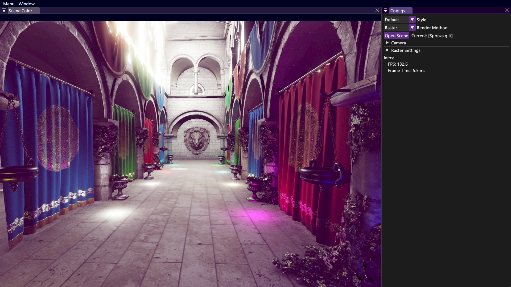
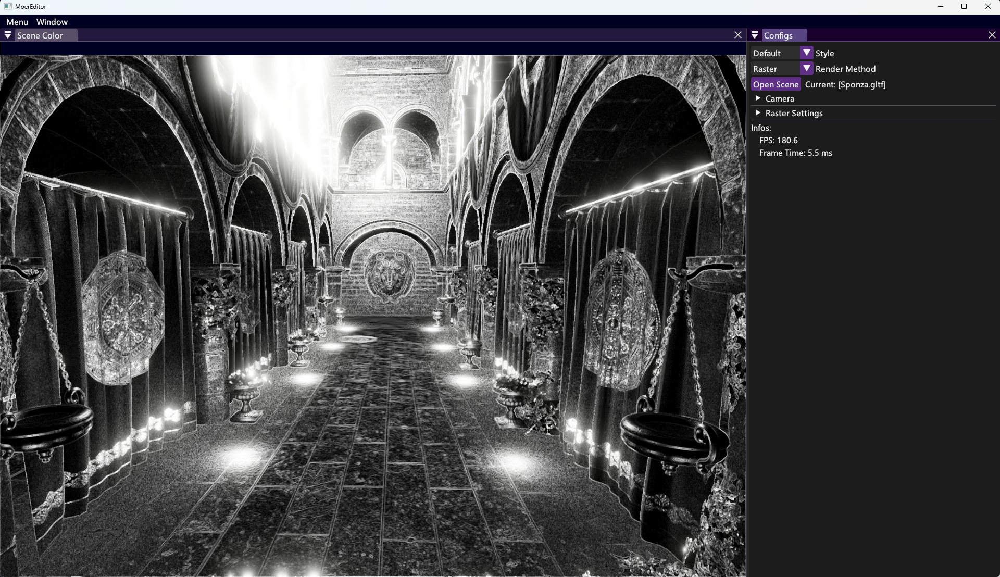
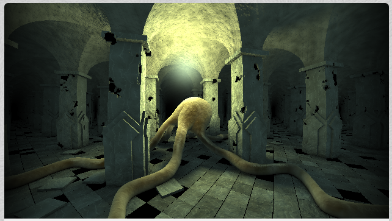
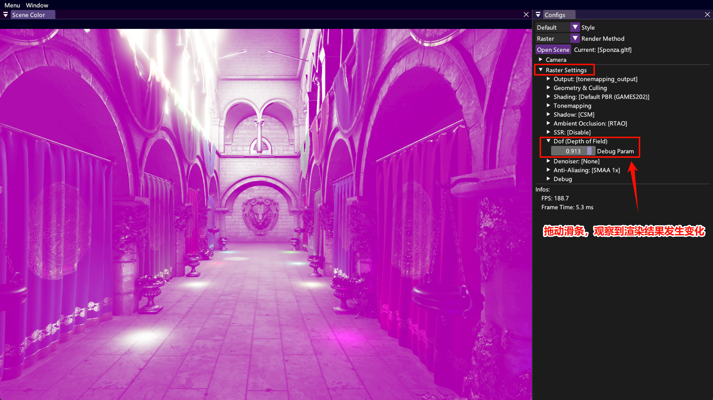
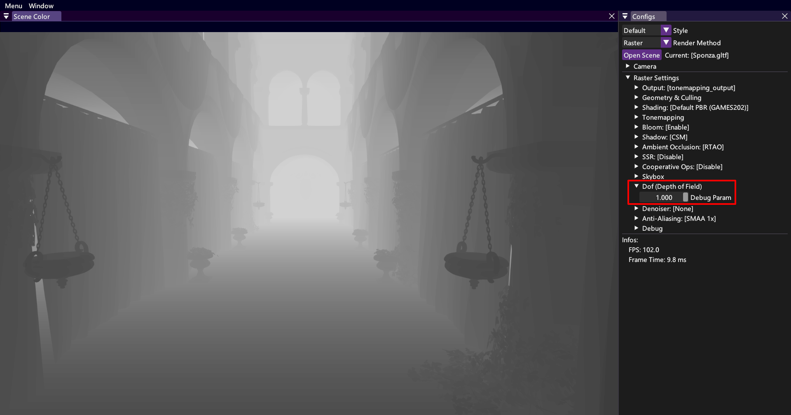
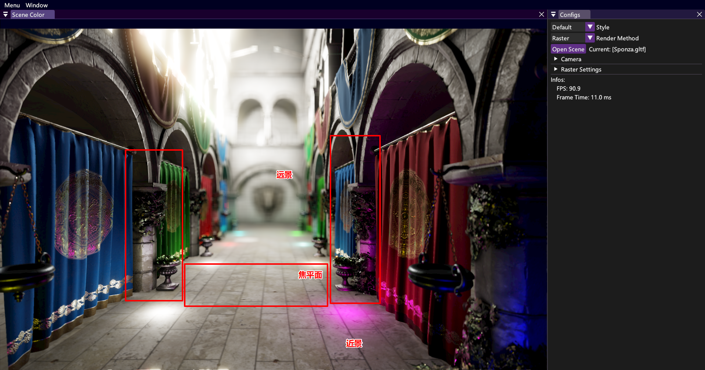
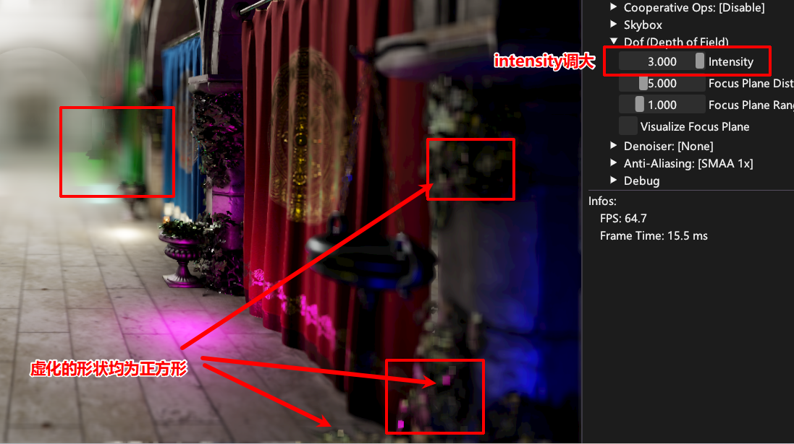
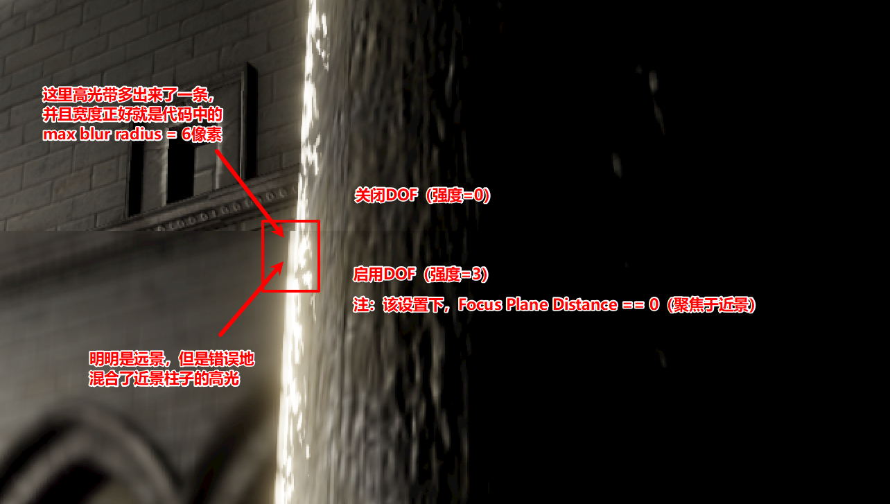

# 如何在MoerEngine中实现 景深 效果？

景深是一个经典的光学现象。

请阅读 [虚幻引擎 Cinematic Depth of Field文档](https://dev.epicgames.com/documentation/zh-cn/unreal-engine/cinematic-depth-of-field-in-unreal-engine)，这篇文章写的特别优秀，有非常多解释光路的示意图，可以加深对于景深的理解。

接下来，笔者将介绍 **在MoerEngine的光栅化渲染器中，实现景深效果** 的具体操作步骤。

## 1. 单Pass景深

我们首先实现一个最基础的单Pass景深。

### 1.1 后处理Pass

渲染管线是由非常多Pass组成的，在 `RasterRenderer.cpp` 中，可以找到如下代码：

```c++
// Post Process Passes
// - Ambient Occlusion
auto              ao_result        = ao_pass->Process(raster_context, raster_config, camera, time);
TextureWithHandle processing_image = ao_result.ao_with_color;
uint              ao_only_idx      = ao_result.ao_only_idx;

rtao_denoiser_pass->ProcessInPlace(raster_context, raster_config, ao_only_idx);

// - Denoiser Pass (Bilateral Filter)
processing_image = bfd_pass->Process(raster_context, raster_config, processing_image);

// - Screen Space Reflection
processing_image = ssr_pass->Process(raster_context, raster_config, camera, processing_image);

// - Anti-aliasing
processing_image = aa_pass->Process(raster_context, raster_config, camera, processing_image);

// - Bloom Pass
processing_image = bloom_pass->Process(raster_context, raster_config, processing_image);

// - Tonemapping Pass
processing_image = tonemapping_pass->Process(raster_context, raster_config, processing_image);
```

上述所有Pass都是 **后处理Pass**。即，这个Pass的输入是全屏像素，输出也是全屏像素，这个Pass的Shader会对像素进行一些处理。例如，`ao_pass->Process(..)` 就是 *环境光遮蔽* 效果。

### 1.2 添加一个后处理Pass

熟悉一个项目最好的方式，就是直接上手改。

为了让你更好地理解引擎的结构，接下来的操作步骤默认在主分支上执行。这样可以确保，你可以在一个没有框架的主分支上，完成从无到有的景深Pass实现；或者添加一个自己的、新的Pass。

我们也提供了一个景深算法的实现框架，你可以将代码切换到 `lab/lab2-dof` 分支。这样，你就可以 **忽略接下来的许多操作**，不需要自己新建文件，只需要完成（复制并黏贴）TODO部分的代码，即可完成最基础的景深效果。

以下是操作步骤：

1. 创建Pass源码

   * 在 `source\runtime\render\renderer\raster\` 目录下，创建 `DofPass.h`

   * 在 `DofPass.h` 内黏贴以下内容：

     ```c++
     #pragma once
     
     #include "scene/camera/Camera.h"
     #include "shader/ShaderPipeline.h"
     #include "shaderheaders/shared/raster/post_process/ShaderParameters.h"
     
     #include "RasterConfig.h"
     #include "RasterResource.h"
     #include "RasterTool.h"
     
     namespace Moer::Render::Raster {
     
     class DofPipeline : public RasterPipeline {
     public:
         DEFINE_RASTER_PIPELINE_CLASS(DofPipeline);
         DEFINE_SHADER_CONSTANT_STRUCT(DofPipelineBindlessParam, param);
         DEFINE_SHADER_BINDLESS_ARRAY(bdls);
         DEFINE_SHADER_ARGS(bdls, param);
     };
     
     class DofPass {
     public:
         DofPass(RasterContext& context) {
             GfxPsoCreateInfo pso_full_screen_info(
                 RHIRasterizeInfo::Preset(),
                 {},
                 {RHIColorAttachmentInfo::Preset(context.textures.dof_output.tex->GetFormat())}
             );
     
             m_dof_pipeline = context.manager.Raster()
                                  .Vertex("core/utils/FullScreenQuad.hlsl")
                                  .Pixel("pipelines/postprocess/color/Dof.hlsl")
                                  .Build<DofPipeline>(std::move(pso_full_screen_info));
         }
     
         TextureWithHandle Process(
             RasterContext&      context,
             const RasterConfig& ui_config,
             const Camera&       camera,
             TextureWithHandle   input_image
         ) {
     
             DofPipelineBindlessParam param;
     
             float2 resolution = float2(input_image.GetSize());
     
             param.resolution      = resolution;                                     // 分辨率
             param.resolution_inv  = float2(1.f / resolution.x, 1.f / resolution.y); // 分辨率倒数
             param.input_color_tex = input_image.hdl;                                // 输入颜色纹理
             param.debug_param     = 0.5f;                                           // 调试参数
     
             context.cmd_list.Gfx(m_dof_pipeline, context.bdls, param)
                 .Draw(
                     "Dof Pass",
                     context.textures.dof_output.GetRect2D(),
                     std::move(RasterTool::GetFullScreenDrawDatas()),
                     ColorAttachment(context.textures.dof_output.tex)
                 );
     
             return context.textures.dof_output;
         }
     
     private:
         DofPipeline m_dof_pipeline;
     };
     
     } // namespace Moer::Render::Raster
     ```

2. 定义Shader参数

   * 打开 `source\runtime\render\shaderheaders\shared\raster\post_process\ShaderParameters.h`

   * 在 `struct SsrPipelineBindlessParam{...};` 后添加如下代码：

     ```c++
     // 1. 该struct中的数据都会被传到Shader中
     // 2. 该struct是C++端和Shader端(HLSL)共享的，所以我们只需要定义一次，就可以在两个语言中共享。
     // 3. 该struct通过PushConstants传入Shader，适合存储每帧变化的数据
     struct DofPipelineBindlessParam {
         float2 resolution;      // 分辨率
         float2 resolution_inv;  // 分辨率倒数
         uint   input_color_tex; // 输入颜色纹理handle
         uint   depth_tex;       // 深度纹理handle（预留）
         float  debug_param;     // 调试参数
         float  near_clip;       // 摄像机近裁剪面（预留）
         float  far_clip;        // 摄像机远裁剪面（预留）
         float  dof_intensity;   // DOF强度（预留）
         float  focus_plane_distance;   // 焦平面距离（预留）
         float  focus_plane_range;      // 焦平面范围（预留）
         uint   b_visualize_focus_plan; // 可视化焦平面（预留）
     };
     ```

3. 创建纹理

   * 打开 `source\runtime\render\renderer\raster\RasterTextures.h`

   * 在 `X(TexHandle, ssr_output, ....) \` 后添加如下代码：

     ```c++
     // 这是一个宏定义，会根据上下文的工具代码，自动创建纹理的申请、重建、释放代码
     // dof_output：            纹理变量名
     // Tex2DTag：              纹理类别
     // PF_R16G16B16A16_SFLOAT：纹理像素格式
     // E_SAMPLED_COLOR：       纹理用途为 SAMPLED | COLOR_ATTACHMENT
     X(TexHandle, dof_output, Tex2DTag, TexConfig::Default(PF_R16G16B16A16_SFLOAT).Usage(E_SAMPLED_COLOR))    \
     ```

4. 创建Shader

   * 在 `shaders\pipelines\postprocess\color\` 目录下，创建 `Dof.hlsl`

   * 在 `Dof.hlsl` 中黏贴：

     ```c++
     #include "core/common/Bindless.hlsl"
     #include "core/common/Common.hlsl"
     BINDLESS_BINDINGS(3, 2, 4, 5)
     #include "materials/Material.hlsli"
     #include "shared/raster/ShaderParameters.h"
     
     [[vk::push_constant]] ConstantBuffer<Moer::DofPipelineBindlessParam> param;
     
     float4 main(float2 uv : TEXCOORD0) : SV_TARGET {
         // uv 即 屏幕坐标，值域为[0, 1]，表示了不同的像素
     
         float3 color       = TextureHandle(param.input_color_tex).Sample2D<float4>(uv).rgb;
         float3 debug_color = float3(1.0, 0.0, 1.0);
     
         color = lerp(color, debug_color, param.debug_param);
     
         return float4(color, 1.0);
     }
     ```

5. 使用Pass

   * 打开 `RasterRenderer.h`，添加以下代码：

     ```c++
     // 1. 前向声明
     //    前向声明是为了加快编译速度，避免对应类型头文件被整体引入到当前文件中，从而导致项目编译时长增加
     
     class SsrPass; // 已有代码
     class DofPass; // 【新增代码】
     
     // 2. Pass对象 声明
     //    UniquePtr就是std::unique_ptr。这里使用指针，是为了兼容前向声明
     
     UniquePtr<SsrPass> ssr_pass; // 已有代码
     UniquePtr<DofPass> dof_pass; // 【新增代码】
     ```

   * 打开 `RasterRenderer.cpp`，添加以下代码：

     ```c++
     // 1. 头文件
     
     #include "SsrPass.h" // 已有代码
     #include "DofPass.h" // 【新增代码】
     
     // 2. Pass对象 初始化
     
     ssr_pass = MakeUnique<SsrPass>(raster_context); // 已有代码
     dof_pass = MakeUnique<DofPass>(raster_context); // 【新增代码】
     
     // 3. Pass对象 执行
     
     // - Screen Space Reflection
     processing_image = ssr_pass->Process(raster_context, raster_config, camera, processing_image); // 已有代码
     
     // - Depth of Field
     processing_image = dof_pass->Process(raster_context, raster_config, camera, processing_image); // 【新增代码】
     ```

6. 重新编译与运行

   ```bash
   cmake --build build -j16
   ./target/bin/Debug/MoerEditor.exe
   ```

   * 你应该会看到如下画面（整个屏幕变紫）
   * 

> 将原图和紫色按照50%和50%的比例进行混合，得到的图像

回顾一下我们刚刚执行的核心代码：

```c++
// 从input_color_tex这个handle，获取上一个Pass的输出画面
float3 color = TextureHandle(param.input_color_tex).Sample2D<float4>(uv).rgb;

// 定义紫色
float3 debug_color = float3(1.0, 0.0, 1.0);

// 根据debug_param来混合上一帧的画面和紫色
color = lerp(color, debug_color, param.debug_param);
```

可以发现，这个效果是符合预期的。你可以修改 `DofPass.h` 中的 `param.debug_param = 0.5f`，将 `0.5f` 修改为 `0.9f`，那么画面会接近全紫色。

这个时候，我们已经可以进行一些比较有意思的修改了。比如，我们想实现一个 **检测边缘的十字算子**（就是机器学习课里学到的东西）。那么，我们就可以在Shader中对输入图像进行采样，并且实现这个功能。

下面这段代码就是Cursor编写的一个检测边缘Shader。**你可以直接将Dof.hlsl的main函数替换为如下代码**：

```c++
// 可以直接替换原来的main函数
float4 main(float2 uv : TEXCOORD0) : SV_TARGET {

    TextureHandle input_texture = TextureHandle(param.input_color_tex);

    // uv 即 屏幕坐标，值域为[0, 1]，表示了不同的像素
    // 这里我们获取了屏幕分辨率的倒数，通过它来计算相邻像素的 uv坐标差值
    // 你可以注释掉下面这行代码，来可视化 uv
    // return float4(uv, 0.0, 1.0); // 很神奇吧！
    float2 delta_uv = param.resolution_inv;

    // 当前像素
    float3 center_color = input_texture.Sample2D<float4>(uv).rgb;
    // 左侧像素
    float3 left_color = input_texture.Sample2D<float4>(uv + float2(-delta_uv.x, 0.0)).rgb;
    // 右侧像素
    float3 right_color = input_texture.Sample2D<float4>(uv + float2(delta_uv.x, 0.0)).rgb;
    // 上方像素
    float3 top_color = input_texture.Sample2D<float4>(uv + float2(0.0, -delta_uv.y)).rgb;
    // 下方像素
    float3 bottom_color = input_texture.Sample2D<float4>(uv + float2(0.0, delta_uv.y)).rgb;

    // 十字方向梯度（edge detection）：简单横向 + 纵向差分
    float3 horizontal_gradient = right_color - left_color;
    float3 vertical_gradient   = bottom_color - top_color;

    // 用长度表示亮度
    float edge_strength = length(horizontal_gradient) + length(vertical_gradient);

    float3 edge_color = edge_strength.xxx;

    return float4(edge_color, 1.0);
}
```



> 边缘检测的十字算子

#### ShaderToy

Shader可以实现无数种有趣、漂亮的动态效果。你可以在 [ShaderToy](https://www.shadertoy.com/) 这个网站上找到许多Shader。此处贴几个笔者非常喜欢的Shader，你可以点进链接，直接查看这些动画效果和对应的代码。

13行代码实现炫光，https://www.shadertoy.com/view/XsXXDn


渲染星空背景的Shader，https://www.shadertoy.com/view/XlfGRj


在全屏Pass中渲染3D图形，https://www.shadertoy.com/view/NtlSDs



以上的效果，在任意一个渲染器的Shader中都可以轻松实现，MoerEngine也不例外。

我们只需要再传入一些参数，例如系统时间、鼠标位置等数据，就可以将这些效果搬到引擎里。如果你想尝试的话，看完下一节之后，就可以自行进行迁移，本文不再赘述。（当然你也可以直接让AI迁移）

### 1.3 UI控制渲染参数

如果每次修改一个参数，我们都要重启引擎，那就太麻烦了！所以，在运行时调整参数，是一个非常必要的功能。

接下来，我们将介绍如何在MoerEngine中用UI控制渲染参数：

1. 在Config中创建参数

   * 打开 `source\runtime\render\renderer\raster\RasterConfig.h`，添加以下代码：

     ```c++
     float ssr_metallic_threshold         = 0.5;   // 已有代码
     float ssr_step_base                  = 0.025; // 已有代码
     
     // MARK: Dof
     float dof_debug_param = 0.5f; // 【新增代码】
     float dof_intensity   = 1.0f; // DOF强度【新增代码】
     float focus_plane_distance = 5.0f; // 焦平面距离【新增代码】
     float focus_plane_range    = 1.0f; // 焦平面范围【新增代码】
     uint  b_visualize_focus_plan = 0; // 可视化焦平面【新增代码】
     ```

2. 创建UI代码

   * 打开 `RasterUI.cpp`，添加一下代码：

     ```c++
     // MARK: SSR
     if (ImGui::TreeNode("SSR", /* ...略 */))) { // 已有代码
         // ...略                                // 已有代码
     }                                           // 已有代码
     
     // 以下均为【新增代码】
     // MARK: Dof
     if (ImGui::TreeNode("Dof (Depth of Field)")) {
         ImGui::SliderFloat("Debug Param", &m_config.dof_debug_param, 0.0f, 1.0f);
         ImGui::SliderFloat("Intensity", &m_config.dof_intensity, 0.0f, 3.0f);
         ImGui::SliderFloat("Focus Plane Distance", &m_config.focus_plane_distance, 0.0f, 20.0f);
         ImGui::SliderFloat("Focus Plane Range", &m_config.focus_plane_range, 0.0f, 5.0f);
     
         bool visualize_focus_plane = m_config.b_visualize_focus_plan != 0;
         if (ImGui::Checkbox("Visualize Focus Plane", &visualize_focus_plane)) {
             m_config.b_visualize_focus_plan = visualize_focus_plane ? 1u : 0u;
         }
         ImGui::TreePop();
     }
     ```

3. 修改 `DofPass.h`

   * 打开 `DofPass.h`，将 `param.debug_param = 0.5f;` 修改为 `    param.debug_param = ui_config.dof_debug_param;`

4. 重置Shader代码（可选）

   * 如果你没有黏贴 边缘过滤的十字算子 代码，则可以跳过这一步

   * 打开 `Dof.hlsl`，将main函数修改为：

     ```c++
     float4 main(float2 uv : TEXCOORD0) : SV_TARGET {
         // uv 即 屏幕坐标，值域为[0, 1]，表示了不同的像素
     
         float3 color       = TextureHandle(param.input_color_tex).Sample2D<float4>(uv).rgb;
         float3 debug_color = float3(1.0, 0.0, 1.0);
     
         color = lerp(color, debug_color, param.debug_param);
     
         return float4(color, 1.0);
     }
     ```

5. 重新编译并运行

   ```bash
   cmake --build build -j16
   ./target/bin/Debug/MoerEditor.exe
   ```

   * 你应该会看到如下选项
   * 

### 1.4 获取深度信息

接下来，我们已经了解了景深所需要的、最基本的代码操作。接下来，让我们开始实现景深效果。

首先，每个像素的虚化程度是根据如下公式计算得到：

$$虚化程度(COC, Circle\ of\ Confusion) = \Large\frac{像素到摄像机的距离\ -\ 焦平面距离}{某参数}$$

所以，我们需要在Shader中获取深度信息。

我们之前已经在 `DofPipelineBindlessParam` 中预留了 `depth_tex`，此处我们直接传入渲染管线计算好的深度纹理信息：

- 打开 `DofPass.h`，添加：

  ```c++
  param.input_color_tex = input_image.hdl; // 已有代码
  param.debug_param     = ui_config.dof_debug_param; // 已有代码
  
  param.near_clip = camera.GetNearClip(); // 摄像机近裁剪面【新增代码】
  param.far_clip  = camera.GetFarClip(); // 摄像机远裁【新增代码】
  param.depth_tex = context.textures.depth_linear_sampler.hdl; // 深度纹理【新增代码】
  param.dof_intensity = ui_config.dof_intensity; // DOF强度【新增代码】
  param.focus_plane_distance = ui_config.focus_plane_distance; // 焦平面距离【新增代码】
  param.focus_plane_range = ui_config.focus_plane_range; // 焦平面范围【新增代码】
  param.b_visualize_focus_plan = ui_config.b_visualize_focus_plan; // 可视化焦平面【新增代码】
  ```

- 打开 `Dof.hlsl`，替换main函数为以下代码：

  ```c++
  float4 main(float2 uv : TEXCOORD0) : SV_TARGET {
      // uv 即 屏幕坐标，值域为[0, 1]，表示了不同的像素
  
      float3 color = TextureHandle(param.input_color_tex).Sample2D<float4>(uv).rgb;
  
      // 深度：值域为 [0, 1]，近处为1，无限远处为0
      // - 另外，MoerEngine使用了Reverse-Z技术。如果你接触过其他渲染器，你会发现此处0和1的对应关系跟通常渲染器不同
      float depth = TextureHandle(param.depth_tex).Sample2D<float>(uv);
  
      // 线性化深度：值域为 [near_clip, far_clip]，单位为世界坐标距离
      float linearized_depth = param.near_clip * param.far_clip / (param.far_clip + (1.0 - depth) * (param.near_clip - param.far_clip));
  
      // 将深度直接映射为颜色
      float3 depth_color = linearized_depth;
  
      // 将深度混合到颜色中，debug_param控制混合程度
      color = lerp(color, depth_color, param.debug_param);
  
      return float4(color, 1.0);
  }
  ```

- 重新编译并运行

然后，将DebugParam混合参数调整为 `1.0`，你可以看到如下画面：



这就是我们场景的深度值，你也可以理解为 **每个点到摄像机的距离信息**。

### 1.5 计算景深效果

接下来，我们开始正式实现景深效果。

在前面的教程中，我们预留了许多UI参数，接下来我们将直接使用这些参数：

1. DOF Intensity：景深强度
2. Focus Plane Distance：焦平面距离
3. Focus Plane Range：焦平面范围
4. Visualize Focus Plane：一个bool值，勾选后则会在引擎中可视化焦平面区域

我们修改 `Dof.hlsl` 的main函数为如下代码：

```c++
float4 main(float2 uv : TEXCOORD0) : SV_TARGET {
    // uv 即 屏幕坐标，值域为[0, 1]，表示了不同的像素

    float3 color = TextureHandle(param.input_color_tex).Sample2D<float4>(uv).rgb;

    // 深度：值域为 [0, 1]，近处为0，无限远处为1
    // - 另外，MoerEngine使用了Reverse-Z技术。如果你接触过其他渲染器，你会发现此处0和1的对应关系跟通常渲染器不同
    float depth = TextureHandle(param.depth_tex).Sample2D<float>(uv);

    float coc = 0.0f;
    float focus_range = max(param.focus_plane_range, 1e-3);

    if (depth <= 1e-4) {
        // 如果当前像素是天空（无限远）
        coc = 1e10; // 一个非常大的值，表示完全虚化

    } else {
        // 正常情况

        // 线性化深度：值域为 [near_clip, far_clip]，单位为世界坐标距离
        float linearized_depth = param.near_clip * param.far_clip / (param.far_clip + (1.0 - depth) * (param.near_clip - param.far_clip));

        // 焦平面距离
        float focus_depth = clamp(param.focus_plane_distance, param.near_clip, param.far_clip);
        // 距离差值
        float signed_delta = linearized_depth - focus_depth;

        float coc_magnitude = max(abs(signed_delta) - focus_range, 0.0) / focus_range * param.dof_intensity;

        // 焦平面附近 coc = 0，背景 coc > 0，前景 coc < 0
        coc = sign(signed_delta) * coc_magnitude;
    }

    // 根据coc计算模糊半径，最大为6像素
    int blur_radius = min(max((int)round(abs(coc)), 0), 6);

    // 根据coc虚化像素
    float3 blur_color = color;
    if (blur_radius > 0) {
        blur_color = 0.0;
        float sample_count = 0.0;
        // 模糊，本质上就是获取周围像素的颜色，然后求平均值（卷积）
        // 下面的代码就是在以当前像素为中心，半径为blur_radius的范围内，采样颜色并求平均值
        [loop]
        for (int y = -blur_radius; y <= blur_radius; ++y) {
            [loop]
            for (int x = -blur_radius; x <= blur_radius; ++x) {
                float2 offset = float2(x, y) * param.resolution_inv;
                blur_color += TextureHandle(param.input_color_tex).Sample2D<float4>(saturate(uv + offset)).rgb;
                sample_count += 1.0;
            }
        }
        blur_color /= sample_count;
    }
    color = blur_color;

    // 可视化焦平面
    if (param.b_visualize_focus_plan != 0) {
        if (abs(coc) <= focus_range) {
            color = color; // do nothing
        } else if (coc > 0.0) {
            color = lerp(color, float3(0.0, 0.0, 1.0), 0.7);
        } else {
            color = lerp(color, float3(0.0, 1.0, 0.0), 0.7);
        }
    }

    return float4(color, 1.0);
}
```

重新编译并运行引擎，你将得到如下画面：



至此，一个简单的景深效果便实现完毕。

## 2. 其他

此处只实现了一个最基础的景深效果。目前的效果既不符合相机物理参数、视觉上也存在许多缺陷、性能还十分差劲：

- 我们不考虑相机fov对应的焦距、相机光圈等物理参数，而是直接使用一系列 *无物理意义* 的参数来描述焦平面、虚化程度。
- 我们的虚化均使用正方形的采样核，这会使得虚化效果不够拟真。如下图所示：
  - 

- 我们目前在同一个纹理中计算前景和背景，这使得前背景的模糊会互相影响。下面这张图的例子，就是聚焦在前景、景深强度拉到最高，这个时候，**前景柱子的黑色就会扩散到背景中，导致背景错误变暗**。这个错误的原因，就是在对背景的像素进行虚化的时候，直接从前景中采样颜色。而这是不符合现实情况的。
  - 

以上内容，都是我们可以做的修复和优化。
