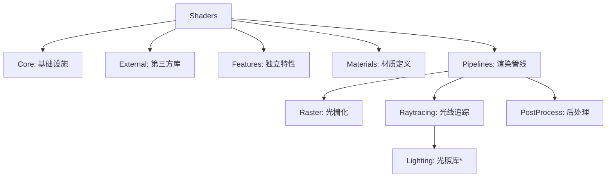

# 🎨 Shaders Architecture

## 🏗️ 目录结构总览



> **注意**：目前的 `lighting` 模块位于 `pipelines/raytracing` 下，虽然包含通用的光照定义（如 `Lighting.hlsl`），但目前主要供Raytracing pipeline使用。

## 📂 详细目录字典

### 1. Core (核心层)

**路径**: `shaders/core/`
所有 Shader 的基石。这里的代码**严禁依赖**其他任何上层模块。

*   **`math/`**: 纯数学库（STL, Math）。
*   **`common/`**: 引擎级通用定义（Bindless 宏, 全屏三角形 VS）。
*   **`utils/`**: 工具函数（纹理拷贝, HiZ 构建）。

### 2. Pipelines (管线层)

**路径**: `shaders/pipelines/`
具体的渲染流程实现。

*   **`raster/`**: 传统光栅化管线。
    *   `deferred/`: 延迟渲染 GBuffer 和 Lighting Pass。
    *   `forward/`: 前向渲染 Pass。目前没有实现。
*   **`raytracing/`**: 光线追踪管线。
    *   `basic/`: 基础光追入口 (RGen, RMiss, RChit)。
    *   `passes/`: 具体的 RT Pass (如 GBufferRT, Composition)。
    *   `restir_di/`: ReSTIR DI 算法的具体实现 Pass。
    *   **`lighting/`**: 光追光照计算核心库（包含 ReSTIR 算法库、预计算逻辑）。
*   **`postprocess/`**: 后处理特效。
    *   `aa/`: 抗锯齿 (TAA, FXAA, SMAA)。
    *   `denoise/`: 降噪器 (Bilateral, NRD 适配)。
    *   `lighting_effects/`: 光照相关的后处理 (SSR, SSAO, SSDO)。

### 3. Materials (材质层)

**路径**: `shaders/materials/`
定义表面的物理属性和材质模型。

*   `Material.hlsl`: 材质数据结构定义。
*   `PbrMaterial.frag.hlsl`: (Legacy) 包含 PBR 计算的 Pass。建议拆分为 `PBR.hlsli`。

### 4. Features (特性层)

**路径**: `shaders/features/`
独立于主渲染管线的功能模块，即插即用。

*   `3dgs/`: 3D Gaussian Splatting 渲染器。
*   `ui/`: 用户界面渲染 (Imgui 等)。
*   `debug/`: 调试工具 (Meshlet Debug, Cull Debug)。

---

## 📏 开发规范 (Guidelines)

为了维护 Shader 代码的整洁和可维护性，请遵循以下规范：

### 1. 文件命名约定

*   **`.hlsl`**: **可编译的 Shader 源文件**。通常包含 `main`, `VSMain`, `raygen` 等入口函数。
    *   *示例*: `GBufferVert.hlsl`, `ToneMappingPass.hlsl`
*   **`.hlsli`**: **头文件/库文件**。仅包含结构体、函数定义，不包含入口点，不可单独编译。
    *   *示例*: `Math.hlsli`, `Lighting.hlsl` (注: 建议库文件统一使用 `.hlsli` 后缀，目前部分历史文件仍为 `.hlsl`)。

### 2. Include 路径规范

*   **绝对路径优先**：所有 `#include` 必须基于 `shaders/` 根目录。
*   **禁止相对回溯**：严禁使用 `../` 回溯路径。
    *   ✅ 正确: `#include "core/math/Math.hlsli"`
    *   ❌ 错误: `#include "../../core/math/Math.hlsli"`
*   **第三方库例外**：`external/` 下的库可能包含其内部的相对引用，请勿随意修改其源码。

### 3. 依赖原则

*   **单向依赖**：`Pipelines` -> `Materials` -> `Core`。
*   **禁止反向依赖**：`Core` 中的文件绝不能 include `Pipelines` 中的文件。
*   **同层引用**：同一管线内的 Pass 可以互相引用（如 `raytracing/passes` 引用 `raytracing/inline`）。

### 4. 废弃代码

*   不要直接删除不再使用的 Shader。
*   将其移动到 **`shaders/deprecated/`** 目录下，保持原有的目录结构，以便未来查阅或恢复。

---

### 🛠️ 常用维护指令

* 这几个脚本，在./shaders目录下直接就行。会从零扫描所有文件，修正引用路径（多执行不会出错，放心用）

**修正hlsl中的 Shader 路径：**

```
./scripts/fix_hlsl_includes.ps1
```

**修正 C++ 中的 Shader 路径:**

```powershell
./scripts/fix_cpp_includes.ps1
```

**查找并移动未引用的 Shader (僵尸代码):**

```powershell
./scripts/isolate_unused_shaders.ps1
```

