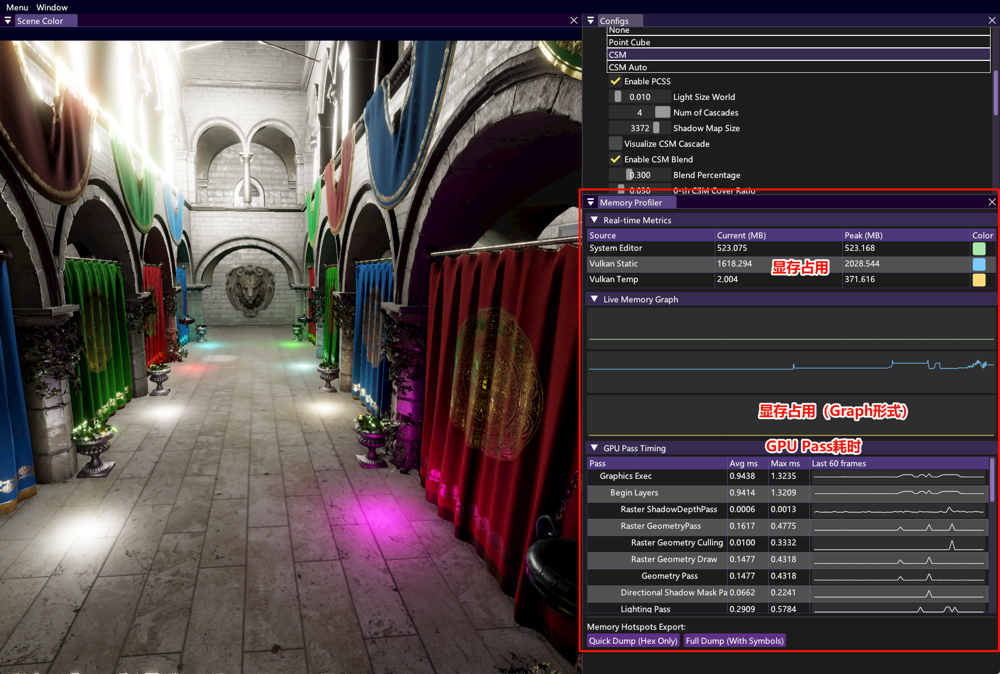

# Profile模块效果图

## 启用步骤

1. 如果根目录下没有 `EnableFeatures.cmake` ，请根据 `template.EnableFeatures.cmake` 创建该文件
2. 在其中启用Profile功能：`set(WITH_PROFILE ON CACHE BOOL "WITH_PROFILE" FORCE)`
3. 重新编译引擎，并且在左上角的Windows窗口中打开 `Memory Profiler`

## 效果图

末尾的两个Dump按钮，可以把数据导出到 *可执行文件所在目录* 的 `logs` 子文件夹下。